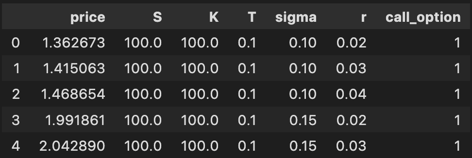

# option-price-simulation

A module for pricing and simulating option prices. Currently, the Black Scholes model is the only model available.

### Installation

```bash
pip install [to_be_filled]
```

### Example usage
```python
import numpy as np
import pandas as pd
from models.BlackScholes import OptionSimulator

# prepare simulator by making numpy arrays of preferred intervals

# S = spot price
S = np.arange(100, 150, 20)
# K = strike price
K = np.arange(100, 150, 20)
# T = time to maturity
T = np.arange(0.1, 1, 0.05)
# v = volatility
v = np.arange(0.1, 0.2, 0.05)
# r = risk-free-rate
r = np.arange(0.02, 0.05, 0.01)

# Initialize the simulator
option_sim = OptionSimulator(S, K, T, v, r)

# Run the simulation:
# .simulate() calculates the option prices for all input combinations and 
# returns all input parameters and option prices in a pandas DataFrame.
df = option_sim.simulate()

df.head()
```

<p align="center">
  
</p>

### Running tests

To run the unit tests, simply:

```bash
python -m pytest
```
